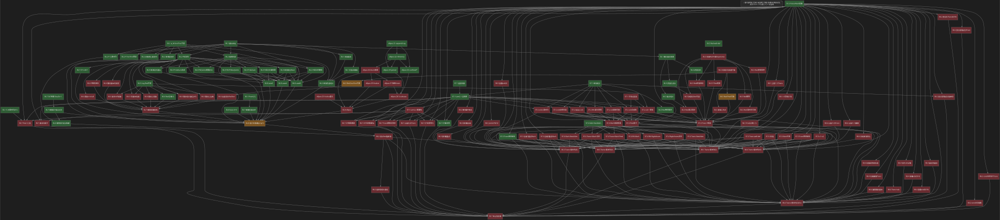

# dag.md — 証明依存関係 DAG (pair sequence system termination)

全命題・補題・定理を 1 つの DAG にしたもの。矢印は**論理含意の向き**：
`A → B` = 「A を使って B を証明」（A が前提・B が結論; A は B の依存先）。
基礎が最上段、最終目標 **§8.7 停止性定理** が最下段（sink）。

- 色: 🟩 緑 = 証明済 / 🟥 赤 = 未証明 / 🟧 橙 = 作業中・再定式化済
- 形: □ 矩形 = 原文にある命題 / ○ 楕円 = 原文に無い我々の補助・証明内分解・内部補題
- §7/§8 のノード内エッジは粗く（節間依存のみ）。critical path・§6.5・§6.8 は詳細。

**▶ 拡大縮小できる対話版（dark mode）: [`dag.html`](dag.html)** をブラウザで開く
（ホイール=ズーム / ドラッグ=移動 / Fit・100% ボタン）。静的プレビュー ↓



> 図のソースは [`dag.dot`](dag.dot)（dark 配色, 形=原文有無）。更新したら:
> ```
> python3 tools/render_dag.py    # dag.dot → dag.svg/png/html を一括再生成
> ```
> `render_dag.py` がレイアウトを計算し、過密ランク（≥10 ノード）を不可視エッジで
> 2 列の階段状に分割（横長 12:1 → 1.4:1）、dark で svg/png を描き、zoom/pan/touch
> 対応の dag.html を生成する。dag.md にソースは置かない。節はラベル接頭辞（§x.y）で識別。

---

## critical path（人間用の要約）

```
基礎(§5,§6.1-6.4) → §6.2/§6.4/§6.7 → §6.8 prop1 → §8.2 切片Red強単項 → §8.7 停止性
                                          ↑
                              [d0pos 枝のみ未] ← d0pos infra Z5-Z9
```

- ★律速 = §6.8 prop1 の **d0pos 枝**（base/caseA/B/C 済）。Z1-Z4 ✅、Z5-Z9 残。
- 別系統 §6.5 Red: keystone `先祖Red不変` が T_PS で偽（A4）、`IncrFirst不変`/`Red·Pred可換`
  が **死枝[20]** 共有障壁。
- §7/§8 のノード内エッジは粗い（節間のみ）。詳細化は各命題の証明着手時に。
